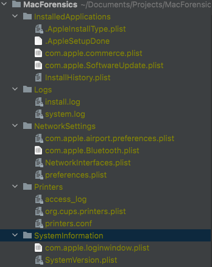

# Mac Forensics

Author: Tobias Weisskopf

Date: 2021-08-20

Description: Python Application to get Forensic Artifacts from macOS. Information on Forensic Artifacts used from [1] (Brandt M., 2017)
Relies on python standard library, so no external libraries are required.

License: MIT

Status: Active

---

## Disclaimer

Use @ your own risk, since this application is still in ALPHA no extensive testing has been done (yet). If you want to help see Contributions section.

---
## Contents

The script gathers evidence from categories such as Installed Applications, Network Settings, Printers, System Information
User Accounts, Keychains, Firewall, Launch Agents and Launch Daemons etc. Not all of them work for all of the versions of
macOS, I am working on implementing some more robust checking of macOS Versions and relative artifacts.

### How to use

- Set verbosity of log file -v --verbose
- Specify output directory -o --output-path
- Specify starting directory -s --start
- To hash or not to hash -H --hash
- Provide a list of directories to skip during collection -w --whitelist

Example: 

> python3 nidaba.py -s / -o /Volumes/collector/

---

## Artifacts to be collected

The OS X specific artifacts that will be collected (in the future) are based on 
- Hacking MacIntosh [1] and,
- OSX Incident Response [2]

The following table keeps track of the artifacts covered:

See database.db for detailed list of artifacts.

## Update February 2022

Created collector script to make a file listing based on OS X Incident Response [2]

### Sample Output

---

## Installation Instructions

1. Clone Repository to your local machine
2. Copy the repository to a USB Stick
3. Connect USB Stick to the target device and,
4. Open a terminal at the location of the script `/Volumes/<USBSTICK>`
5. Run nidaba.py with sudo rights `sudo python3 nidaba.py `

---

## Contributions

Contributors are welcome, please contact me if you like to help in the development. Either on GitHub or via my Twitter handle @_APTwi

---

## References

[1] Brandt, M. (2017). Mac OS Hacking: Professionelle Werkzeuge und Methoden zur forensischen Analyse des Apple-Betriebssystems. Haar: Franzis Verlag.

[2] Bradley, Jaron. OS X Incident Response (p. 76). Elsevier Science. Kindle Edition.

---

### Other Inspirations

https://github.com/Yelp/osxcollector/blob/master/osxcollector/osxcollector.py

https://github.com/mac4n6/macMRU-Parser/blob/master/macMRU.py

https://github.com/cugu/awesome-forensics
